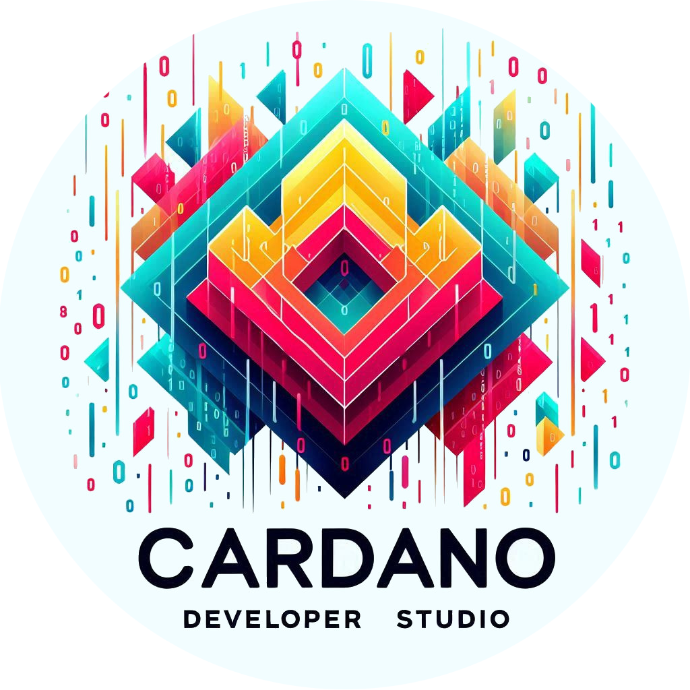

<!-- Improved compatibility of back to top link: See: https://github.com/othneildrew/Best-README-Template/pull/73 -->

<!--
*** Thanks for checking out the Best-README-Template. If you have a suggestion
*** that would make this better, please fork the repo and create a pull request
*** or simply open an issue with the tag "enhancement".
*** Don't forget to give the project a star!
*** Thanks again! Now go create something AMAZING! :D
-->

<!-- PROJECT SHIELDS -->
<!--
*** I'm using markdown "reference style" links for readability.
*** Reference links are enclosed in brackets [ ] instead of parentheses ( ).
*** See the bottom of this document for the declaration of the reference variables
*** for contributors-url, forks-url, etc. This is an optional, concise syntax you may use.
*** https://www.markdownguide.org/basic-syntax/#reference-style-links
-->
[![Contributors][contributors-shield]][contributors-url]
[![Forks][forks-shield]][forks-url]
[![Stargazers][stars-shield]][stars-url]
[![Issues][issues-shield]][issues-url]
[![MIT License][license-shield]][license-url]
[![LinkedIn][linkedin-shield]][linkedin-url]
<!-- PROJECT LOGO -->
 

  

<h3 align="center">Cardano Developer Studio</h3>

  

    The best toolkit for the cardano developer.
     
    <a href="https://protofire-docs.gitbook.io/developer-studio"><strong>Explore the docs »</strong></a>
     
     
    <a href="https://youtu.be/C9Ge6xyf6-o">View Demo</a>
    ·
    <a href="https://github.com/protofire/Cardano-Developer-Studio/issues">Report Bug</a>
    ·
    <a href="https://github.com/protofire/Cardano-Developer-Studio/issues">Request Feature</a>
  

## Overview

This repository is the home of the Cardano Developer Studio, an all-in-one suite
designed to streamline the development process for Cardano blockchain
developers. Our goal is to provide an accessible, comprehensive set of tools and
resources to support developers in building dApps and smart contracts
efficiently on the Cardano platform.

## Table of Contents

- [Cardano Developer Studio](#cardano-developer-studio)
  - [Overview](#overview)
  - [Table of Contents](#table-of-contents)
  - [Documentation](#documentation)
  - [Features](#features)
  - [Features of Developer Studio](#features-of-developer-studio)
  - [Why Developers Need to Experiment with These Tools](#why-developers-need-to-experiment-with-these-tools)
  - [What is included](#what-is-included)
  - [Installation and Setup](#installation-and-setup)
  - [Docker Containers](#docker-containers)
  - [Development Container in VS Code](#development-container-in-vs-code)
  - [Using the Toolbox CLI](#using-the-toolbox-cli)
  - [Using the Docker Containers](#using-the-docker-containers)
  - [Smart Contracts Examples and Helpers Library](#smart-contracts-examples-and-helpers-library)
  - [Cardano Web3 Frontend Template](#cardano-web3-frontend-template)
  - [Contribution](#contribution)
  - [License](#license)
  - [Acknowledgements](#acknowledgements)
  - [Ongoing Progress](#ongoing-progress)

## Documentation

**Gitbook**

https://protofire-docs.gitbook.io/developer-studio/

## Features

## Features of Developer Studio

- **Seamless Docker Compose Configurations**: Effortlessly set up and integrate all essential tools with Docker Compose, providing a consistent development environment across different platforms. Our configuration includes containers for the Cardano Node, DB Sync, Wallet Server, Kupo, Ogmios, and a specialized Cardano Development Container equipped with Cabal and GHC, tailored to compile Haskell code for smart contracts.
- **Intuitive Toolbox CLI**: Our easy-to-use Toolbox CLI offers a menu-driven interface to navigate, configure, and run a wide array of tools directly from the terminal, making development and deployment processes more efficient.
- **Real-World Smart Contract Examples**: Dive into a collection of practical Plutus smart contract examples, tailored for real-world applications on the Cardano blockchain. These examples help you understand and implement various functionalities quickly and effectively.
- **Robust Testing Tools**: Leverage our comprehensive testing suite designed for evaluating resource consumption, transaction sizes, and contract compliance with Plutus constraints, ensuring your smart contracts are optimized for performance and security.
- **Integrated Web3 Frontend Template**: Quickly build and deploy dApps on the Cardano blockchain using our ready-to-go React-based frontend template. This integration ensures a smooth workflow from smart contract development to dApp deployment.
- **Automated CI/CD Pipelines**: Streamline your development lifecycle with our fully automated CI/CD pipelines. These pipelines handle everything from testing and building to deploying smart contracts and frontend applications, ensuring rapid and reliable releases.
- **Scalable Docker Integration**: Deploy your applications effortlessly using production-ready Docker images, enabling easy scaling and consistent deployment across different environments. Our Docker integration ensures that your dApps and smart contracts run reliably, no matter where they're deployed.
- **End-to-End Blockchain Solutions**: Developer Studio bridges the gap between smart contract development and real-world dApp deployment, offering all the tools you need to build, test, and launch robust blockchain applications on the Cardano network.

## Why Developers Need to Experiment with These Tools

Experimentation leads to innovation. By getting hands-on experience with the Cardano Node, Wallet, and DB Sync, developers can push the boundaries of what's possible within the Cardano ecosystem. It's not just about building applications; it's about understanding the intricacies of blockchain technology and leveraging that knowledge to create solutions that are secure, efficient, and user-friendly.

For instance, experimenting with the Cardano Node can help developers optimize transaction fees, understand block propagation, and secure their applications against common blockchain threats. Learning the ins and outs of the Cardano Wallet can lead to the development of new wallet features, improved user security practices, and the integration of ADA payments into e-commerce platforms. And with Cardano DB Sync, the possibilities for blockchain data analytics, reporting tools, and real-time monitoring services are endless.

## What is included

See [What is included](./docs/README_INCLUDED.md)

## Installation and Setup

See [Installation and Setup](./docs/README_INSTALLATION.md)

## Docker Containers

See [Docker Containers](./docs/README_DOCKER.md)

## Development Container in VS Code

See [Development Container in VS Code](./docs/README_VSCODE.md)

## Using the Toolbox CLI

See [Using the Toolbox CLI](./docs/README_SCRIPT.md)

## Using the Docker Containers

See [Using the Docker Containers](./docs/README_CONTAINERS.md)

## Smart Contracts Examples and Helpers Library

See [Smart Contracts Examples and Helpers Library](./cardano-smart-contracts-examples/README.md)

## Cardano Web3 Frontend Template

See [Cardano Web3 Frontend Template](./cardano-web3-frontend-template/README.md)

## Contribution

Contributions to the Cardano Developer Studio are welcome. Whether you're
looking to fix bugs, add new features, or improve documentation, your help is
appreciated. Please see our contribution guidelines for more information.

## License

This project is licensed under the GNU General Public License v3.0 - see the
[LICENSE](LICENSE) file for details.

## Acknowledgements

We express our deepest gratitude to the Cardano community for their unwavering
support and valuable contributions to this project. This work is part of a
funded project through Cardano Catalyst, a community-driven innovation platform.
For more details on the proposal and its progress, please visit our proposal
page on [IdeaScale](https://cardano.ideascale.com/c/idea/110047).

## Ongoing Progress

Welcome to the culmination of our journey! You're now experiencing the final milestone and release of our Cardano Developer Studio. We've laid a strong foundation and built upon it with a comprehensive suite of tools, features, and integrations to make your Cardano development experience as seamless and powerful as possible.

This release marks a significant achievement in our commitment to providing developers with everything they need to build, test, and deploy smart contracts and dApps on the Cardano blockchain. Our Toolbox CLI, extensive Docker integration, real-world smart contract examples, and automated CI/CD pipelines have all been crafted to support your development journey from start to finish.

While this marks the final milestone for the initial phase, the journey doesn't end here. The Cardano Developer Studio will continue to evolve, with future updates focusing on refining and expanding the tools and functionalities available. We are committed to listening to your feedback and supporting the community as we move forward together.

Thank you for being part of this journey with us. Your ideas and contributions have been invaluable, and we look forward to seeing what you will create with the tools provided. Let's continue to build the future of the Cardano ecosystem together!

<!-- MARKDOWN LINKS & IMAGES -->
<!-- https://www.markdownguide.org/basic-syntax/#reference-style-links -->
[contributors-shield]: https://img.shields.io/github/contributors/protofire/Cardano-Developer-Studio.svg?style=for-the-badge
[contributors-url]: https://github.com/protofire/Cardano-Developer-Studio/graphs/contributors
[forks-shield]: https://img.shields.io/github/forks/protofire/Cardano-Developer-Studio.svg?style=for-the-badge
[forks-url]: https://github.com/protofire/Cardano-Developer-Studio/network/members
[stars-shield]: https://img.shields.io/github/stars/protofire/Cardano-Developer-Studio.svg?style=for-the-badge
[stars-url]: https://github.com/protofire/Cardano-Developer-Studio/stargazers
[issues-shield]: https://img.shields.io/github/issues/protofire/Cardano-Developer-Studio.svg?style=for-the-badge
[issues-url]: https://github.com/protofire/Cardano-Developer-Studio/issues
[license-shield]: https://img.shields.io/github/license/protofire/Cardano-Developer-Studio.svg?style=for-the-badge
[license-url]: https://github.com/protofire/Cardano-Developer-Studio/blob/master/LICENSE
[linkedin-shield]: https://img.shields.io/badge/-LinkedIn-black.svg?style=for-the-badge&logo=linkedin&colorB=555
[linkedin-url]: https://www.linkedin.com/company/protofire-io/posts/?feedView=all
[product-screenshot]: images/screenshot.png
[usage-example]: images/example.png
